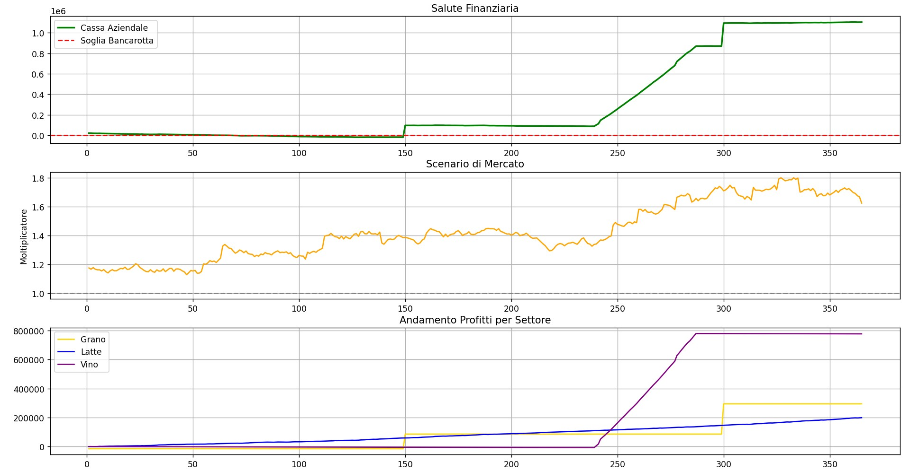
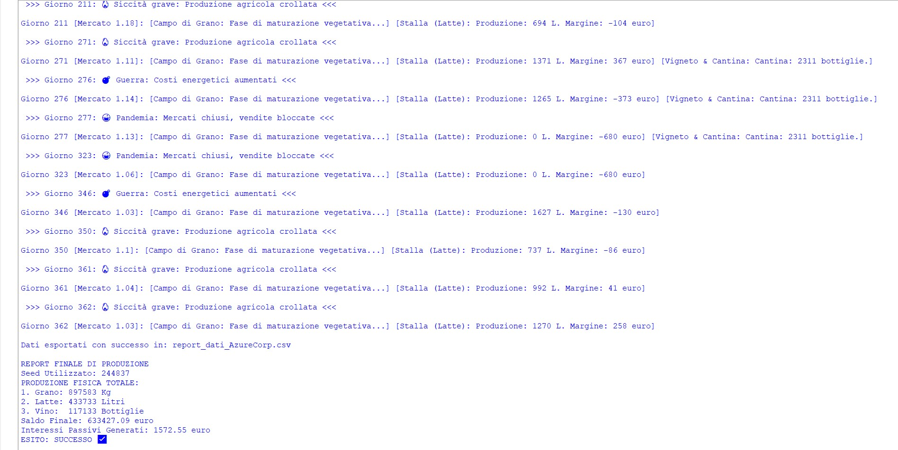

# 🌾 Simulatore Stocastico Agricolo – Tesi di Laurea in Informatica


> **EN English version available here → [Read in English](./README_EN.md)**

## 🌟 Panoramica

Questo progetto è un **simulatore stocastico sviluppato in Python**, realizzato come tesi finale per il conseguimento della Laurea Triennale in Informatica.

L'applicazione modella dinamicamente l'andamento di indicatori chiave di prestazione (KPI) economici e produttivi nel tempo all'interno di un contesto agricolo. Il sistema calcola le variazioni giornaliere basandosi su variabili finanziarie reali, applicando logiche decisionali condizionate dalla generazione probabilistica di eventi imprevisti.

L'obiettivo principale del progetto è la progettazione di un motore di calcolo scalabile, focalizzato sulla modellazione algoritmica complessa, sulla programmazione orientata agli oggetti (OOP) e sulla visualizzazione avanzata dei dati.

---

## 📸 Screenshot

| **Analisi Trend Finanziari (Matplotlib)** | **Impatto Eventi Avversi (Console/Log)** |
|:---:|:---:|
|  |  |

---

## Come avviare il progetto

Per eseguire questa applicazione, è sufficiente lanciare il file principale Python.

### Prerequisiti
* **Python 3.11+** installato.
* Gestore di pacchetti **pip**.

### Step 1: Configurazione dell'Ambiente
Aprire un terminale nella cartella del progetto ed eseguire:
```bash
# Creazione di un virtual environment (Consigliato)
python -m venv venv

# Attivazione del virtual environment
# Su Windows:
venv\Scripts\activate
# Su Mac/Linux:
source venv/bin/activate
Step 2: Installazione delle dipendenze ed esecuzione
Bash
# Installazione delle librerie necessarie (Matplotlib, NumPy, ecc.)
pip install -r requirements.txt

# Avvio del simulatore
python main.py
Il motore di calcolo opera in un ambiente rigorosamente parametrizzato tramite il modulo config.py. 
```
### Parametri Iniziali (Default difficoltà Media)

- Budget Iniziale: 20000.0 €

- Indice Meteo (Stabilità): 0.7 (0.0 stabile, 1.0 caotico)

- Tasso di Interesse Passivo: 0.20 (20%)

- Probabilità Evento Avverso: 0.04 (4%)

- Costi Fissi (Affitto e Tasse Giornaliere): 150.0 €

- Nota: La simulazione supporta l'inserimento di un SEED specifico per garantire la totale riproducibilità degli scenari generati.

---  

### Architettura del Software
- Il codice applica rigorosamente il principio di separazione delle responsabilità (Separation of Concerns), dividendo la configurazione, la logica di dominio e il motore di esecuzione.

### config.py (Configuration Manager)
- Isola tutti i parametri globali, permettendo il bilanciamento del modello senza alterare la logica del codice.

### classi.py (Domain Logic & OOP)
- Implementa l'architettura a oggetti. Utilizza una superclasse UnitaProduttiva da cui ereditano i moduli specifici (CampoGrano, Stalla, Vigneto), sfruttando il polimorfismo per il calcolo dei bilanci giornalieri.

### main.py (Simulation Engine)
- Cuore algoritmico del sistema. Gestisce il ciclo temporale, applica distribuzioni statistiche (Gaussiane e Uniformi) per l'andamento del mercato, e orchestra l'esportazione dei dati.

---

### Tecnologie Utilizzate

- Linguaggio: Python 3.11

- Data Visualization: Matplotlib

- Matematica Stocastica: NumPy, modulo random nativo

- Gestione Dati: modulo csv nativo per l'esportazione di dataset strutturati

---

### Funzionalità Principali
- Motore Stocastico e Analisi del Rischio
Calcolo delle variazioni di mercato tramite algoritmi di randomizzazione avanzati (distribuzioni gaussiane e uniformi).

- Sistema di iniezione di eventi imprevisti a impatto asimmetrico (es. Siccità, Guerra, Pandemia, Boom Export) che alterano dinamicamente i moltiplicatori di prezzo e produzione.

- Generazione Dinamica dei Dati e Visualizzazione

- Monitoraggio in tempo reale del flusso di cassa, del debito e dei profitti settoriali.

- Esportazione automatizzata dei risultati in file .csv (report_dati_AzureCorp.csv) per l'analisi esterna.

- Rendering di dashboard grafiche multi-plot tramite Matplotlib (Salute Finanziaria, Scenario di Mercato, Andamento Settoriale).

---

### Logica Finanziaria Enterprise
- Gestione automatizzata di interessi passivi giornalieri in caso di saldo negativo.

- Sistema di early-exit per bancarotta irreversibile basato su soglie di deficit preimpostate.

---

### Competenze Acquisite
- Attraverso lo sviluppo di questa tesi ho maturato esperienza pratica in:

- Progettazione e implementazione di algoritmi stocastici e distribuzioni di probabilità.

- Architettura software Object-Oriented (OOP) applicata a modelli di simulazione complessi.

- Elaborazione, tracciamento ed esportazione di dataset programmatici per la Business Intelligence.

---

### Note
- Questo progetto è una Tesi in Informatica. Il focus primario risiede nell'ingegneria del software, nella solidità algoritmica e nella manipolazione dei dati, piuttosto che nelle logiche di microeconomia.

- I commenti al codice sorgente, i nomi delle variabili e l'output della console sono mantenuti in italiano per rispettare i requisiti accademici originali richiesti dalla facoltà.

---

### Licenza
Progetto realizzato a scopo didattico, tesi accademica e portfolio personale.

### Autore
Sviluppato da Oleksandr Bevtsyk
